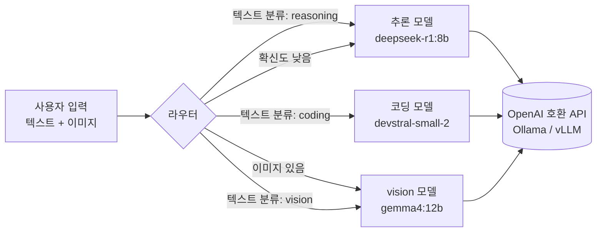

# 구조와 설계 결정

## 전체 흐름

## 코드 구조와 임베디드 비유

| 모듈 | 역할 | 임베디드 비유 |
|---|---|---|
| `types.py` | 공용 데이터 타입 | 공용 헤더 `types.h` |
| `config.py` + `configs/models.yaml` | 모델 설정 로드·검증 | Kconfig, 보드 설정 헤더 |
| `backends/` | 모델 호출 | HAL (하드웨어 추상화 계층) |
| `routers/` | 어느 모델로 보낼지 결정 | 인터럽트 디스패처의 판단 로직 |
| `pipeline.py` | 라우터와 백엔드 연결 | main loop |
| `evaluation.py` | 정확도 측정 + 보고서 생성 | 테스트 지그 + 측정 로그 |
| `cli.py` | 터미널 명령 | 디버그 콘솔 명령 |

## 설계 결정 기록

### 1. Ollama 전용 SDK 대신 OpenAI 호환 API를 쓴다
- Ollama와 vLLM은 둘 다 `/v1/chat/completions` 형식을 지원합니다.
- 회사에서 vLLM으로 옮길 때 `configs/models.yaml`의 `base_url`만 바꾸면 됩니다.
- 대가: Ollama 고유 기능(예: `keep_alive`로 모델을 메모리에 얼마나 유지할지 지정)은 이 인터페이스로 직접 제어할 수 없습니다. 필요하면 Ollama 서버의 환경변수로 설정합니다([setup.md](setup.md) 참고).

### 2. 이미지가 첨부되면 라우터 판단 없이 vision으로 보낸다
- 이미지를 처리할 수 있는 모델은 vision 모델뿐이므로 이것은 선택이 아니라 **제약 조건**입니다.
- `Router.route()`(부모 클래스)에서 처리하므로 규칙/임베딩/LLM 라우터 모두 같은 규칙을 따릅니다.
- 그래서 라우터 간 비교는 사실상 **텍스트 분류 능력**만 비교하게 됩니다.

### 3. vision 카테고리는 텍스트로 된 디자인 질문도 맡는다
- "레이아웃을 어떻게 배치할까?"처럼 이미지 없는 UI/UX 질문도 vision 모델로 보냅니다.
- 이유: 카테고리 3개를 모두 텍스트로 분류하게 해야 라우터 비교 실험이 의미가 있습니다.
- 검증할 가설: vision 모델(4B)이 디자인 질문에서 추론 모델(9B)보다 나은가? → 모델 비교 문서의 주제가 됩니다.

### 4. 확신도가 낮으면 기본 카테고리(reasoning)로 보낸다 (fallback)
- 기준값은 `--threshold`(기본 0.5)로 조절합니다.
- 기준을 높이면 오분류는 줄지만 fallback이 늘어납니다. 이 관계(trade-off)도 측정해 볼 만한 주제입니다.

### 5. 라우터 순서: 직접 구현 3종 → 오픈소스
1. 규칙 기반 (`rule`) ✅
2. 임베딩 유사도 (`embedding`): Ollama 임베딩 모델 사용 예정 (한국어를 지원하는 `bge-m3` 또는 `qwen3-embedding:0.6b`)
3. 소형 LLM 분류기 (`llm`): 작은 모델(예: `qwen3.5:0.8b`, 1.0GB) 등
4. 오픈소스 비교: `semantic-router`, `RouteLLM` 등을 같은 평가셋으로 측정
