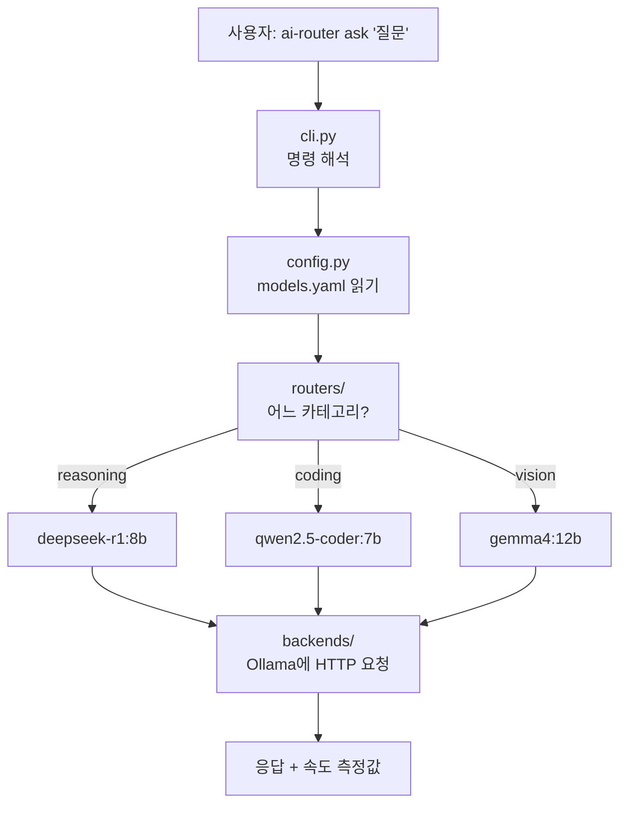
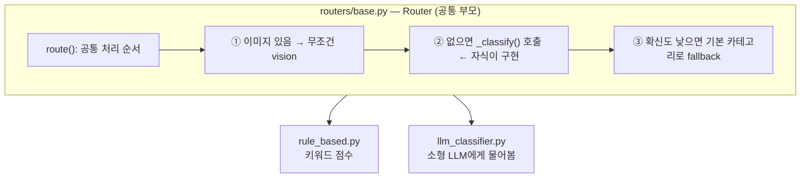

# 코드 읽는 순서 안내서 (구현할 때의 사고 순서대로)

이 문서는 코드를 **파일 이름순이 아니라, 처음부터 만든다면 머릿속에서 떠올릴 순서**로 따라갑니다.
각 단계는 "어떤 질문에서 출발했나 → 무엇을 구현했나 → 코드가 어떻게 생겼나" 순서입니다.

> 줄 번호는 작성 시점(2026-09-20) 기준입니다. 코드가 바뀌면 조금 어긋날 수 있으니, 함수 이름으로 찾으세요.

---

## 1. 한 장 지도: 요청 하나가 지나가는 길



핵심은 **"판단(라우터)"과 "실행(백엔드)"을 분리**했다는 점입니다. 임베디드로 치면 이렇습니다.

| 이 프로젝트 | 임베디드 비유 |
|---|---|
| 라우터 | 인터럽트 번호를 보고 어느 핸들러로 보낼지 정하는 디스패처 |
| 백엔드 | 실제 일을 하는 드라이버 (HAL 뒤에 숨은 하드웨어) |
| 파이프라인 | 둘을 이어 주는 main loop |
| `models.yaml` | Kconfig, 보드별 설정 헤더 |
| 평가(evaluation) | 테스트 지그 + 측정 로그 |

---

## 2. 구현 순서 한눈에 보기

| 단계 | 스스로에게 던진 질문 | 구현한 것 | 파일 |
|---|---|---|---|
| 1 | 무엇이 들어오고 무엇이 나가야 하지? | 데이터 구조 정의 | [types.py](../src/ai_router/types.py) |
| 2 | 바뀔 수 있는 값은 코드 밖에 두자 | 설정 파일 + 로더 | [config.py](../src/ai_router/config.py), [models.yaml](../configs/models.yaml) |
| 3 | 모델은 어떻게 부르지? | 백엔드 (HAL) | [backends/](../src/ai_router/backends/) |
| 4 | 누구에게 보낼지 어떻게 정하지? | 라우터 3층 구조 | [routers/](../src/ai_router/routers/) |
| 5 | 이것들을 어떻게 이어 붙이지? | 파이프라인 | [pipeline.py](../src/ai_router/pipeline.py) |
| 6 | 라우터가 잘하는지 어떻게 알지? | 평가 도구 + 정답 데이터 | [evaluation.py](../src/ai_router/evaluation.py), [data/eval/](../data/eval/) |
| 7 | 사람이 어떻게 쓰지? | 명령어 | [cli.py](../src/ai_router/cli.py) |
| 8 | 모델 없이도 검증하려면? | 가짜 백엔드 + 테스트 | [tests/](../tests/) |

**읽는 순서 추천:** 1 → 2 → 3 → 4 → 5를 먼저 읽으면 "요청이 어떻게 처리되는지"를 알 수 있습니다. 6, 7, 8은 그 다음에 읽어도 됩니다.

---

## 3. 단계별 설명

### 단계 1. 데이터 구조 정의 — [types.py](../src/ai_router/types.py)

**질문:** 시스템에 들어오는 것과 나가는 것은 무엇인가?
임베디드에서 통신 프로토콜을 짤 때 패킷 구조체부터 정의하는 것과 같습니다. 코드를 짜기 전에 "데이터의 모양"부터 정합니다.

| 구조 | 담는 것 | 위치 |
|---|---|---|
| `Category` | 라우팅 목적지 3개: reasoning / coding / vision | `types.py:16` |
| `UserRequest` | 사용자 입력: 텍스트 + 첨부 이미지 경로 | `types.py:30` |
| `RouteDecision` | 라우터의 판단: 카테고리, **확신도**, **근거**, 걸린 시간, fallback 여부 | `types.py:42` |
| `ChatResult` | 모델 응답: 텍스트, TTFT, 전체 시간, 토큰 수 | `types.py:57` |
| `PipelineResult` | 위 결과들을 묶은 최종 결과 | `types.py:81` |

**눈여겨볼 점:** `RouteDecision`이 카테고리만 돌려주지 않고 "왜 그렇게 판단했는지(`reason`)"와 "확신도(`confidence`)"를 함께 남깁니다. 나중에 틀린 답을 분석할 때 이 정보가 있어야 원인을 찾을 수 있기 때문입니다.

`BaseModel`(pydantic)을 상속한 클래스는 C의 `struct`처럼 필드를 선언하는 것이라고 보시면 됩니다. 다른 점은 잘못된 타입이 들어오면 즉시 에러를 낸다는 것입니다.

---

### 단계 2. 설정 분리 — [config.py](../src/ai_router/config.py) + [models.yaml](../configs/models.yaml)

**질문:** 모델 이름, 온도 같은 값을 코드에 박아 두면 바꿀 때마다 코드를 고쳐야 하지 않나?

- **`models.yaml`** 에 "어떤 역할에 어떤 모델을 쓰는지"를 적습니다. 서버 주소(`base_url`)도 여기 있습니다. 회사에서 vLLM으로 옮길 때는 이 파일만 바꿉니다.
- **`config.py`** 는 그 파일을 읽어서 파이썬 객체로 바꾸고 **검증**합니다 (`load_config`, `config.py:49`). 오타가 있으면 프로그램 시작 시점에 바로 에러가 납니다. 부팅 시 설정값을 검사하는 것과 같습니다.

```yaml
models:
  coding:
    name: "qwen2.5-coder:7b"
    temperature: 0.2      # 코드는 일관성이 중요하니 낮게
router_llm:               # 라우터 전용 소형 분류기
  name: "qwen3.5:2b"
  extra_body:             # 엔진 전용 옵션은 코드가 아니라 설정에 둠
    reasoning_effort: "none"
```

---

### 단계 3. 백엔드 — [backends/](../src/ai_router/backends/)

**질문:** 모델을 어떻게 부르지? 그리고 Ollama가 아니라 vLLM으로 바뀌면?

두 파일로 나눴습니다.

| 파일 | 역할 | 비유 |
|---|---|---|
| [base.py](../src/ai_router/backends/base.py) `ChatBackend` | "chat()과 list_models()가 있어야 한다"는 **인터페이스**만 선언 | HAL 헤더 |
| [openai_compat.py](../src/ai_router/backends/openai_compat.py) `OpenAICompatBackend` | 실제 구현 | HAL 구현체 |

Ollama와 vLLM은 둘 다 **OpenAI와 같은 형식의 HTTP API**를 제공합니다. 그래서 구현체가 하나뿐이고, 서버가 바뀌면 `base_url`만 바꾸면 됩니다.

`chat()`이 하는 일 (`openai_compat.py:48`):

1. **메시지 만들기:** 이미지가 있으면 base64 텍스트로 바꿔 함께 담습니다 (`_image_to_data_url`, `:27`). API는 텍스트(JSON)로 통신하기 때문입니다.
2. **스트리밍으로 받기:** 모델이 토큰을 만들 때마다 조각(chunk)으로 받습니다. UART로 바이트가 하나씩 들어오는 것과 비슷합니다.
3. **시간 재기:** 첫 조각이 도착한 시점을 기록해 **TTFT**(첫 글자까지 걸린 시간)를, 마지막 조각까지의 시간으로 전체 시간과 초당 토큰 수를 계산합니다. 한 번에 받으면 TTFT를 잴 수 없어서 스트리밍을 씁니다.

---

### 단계 4. 라우터 — [routers/](../src/ai_router/routers/)

**질문:** 프롬프트를 보고 어느 모델로 보낼지 어떻게 정하지?
이 프로젝트의 핵심이라 3층으로 나눴습니다.



#### 4-1. 공통 부모 — [routers/base.py](../src/ai_router/routers/base.py) `Router.route()` (`:61`)

모든 라우터가 공유하는 규칙을 한곳에 둡니다.

1. **이미지가 있으면 판단 없이 vision.** 이미지를 볼 수 있는 모델이 vision 모델뿐이라서, 선택이 아니라 제약 조건입니다.
2. 텍스트만 있으면 자식 클래스의 `_classify()`를 호출합니다.
3. 확신도가 기준(`threshold`, 기본 0.5)보다 낮으면 `default_category`(reasoning)로 보냅니다.

자식 클래스는 **`_classify()`만 구현**하면 됩니다. 라우터를 새로 만들 때 나머지는 신경 쓰지 않아도 되고, 모든 라우터가 같은 조건에서 비교됩니다.

#### 4-2. ① 규칙 기반 — [rule_based.py](../src/ai_router/routers/rule_based.py)

**아이디어:** 키워드마다 점수를 매겨서 합계가 가장 큰 카테고리를 고릅니다.

```
"파이썬으로 퀵정렬 함수를 구현해줘"
   '파이썬' → coding +1.5   '함수' → coding +1   '구현' → coding +1
   coding = 3.5, 나머지 0   →  coding, 확신도 = 3.5 / 3.5 = 1.0
```

- 신호 목록은 `SIGNALS` (`:47`), 점수 계산은 `RuleBasedRouter._classify` (`:183`).
- **확신도 = 1등 점수 ÷ 전체 점수 합.** 키워드가 하나도 없으면 0이라 fallback으로 갑니다.
- 장점은 0.03ms 수준으로 빠르고, 왜 그렇게 판단했는지 100% 설명 가능하다는 점입니다.
- 단점은 목록에 없는 표현은 못 잡는다는 점입니다. 아래 3장의 실제 예시에서 확인할 수 있습니다.

#### 4-3. ③ 소형 LLM 분류기 — [llm_classifier.py](../src/ai_router/routers/llm_classifier.py)

**아이디어:** 작은 언어 모델(`qwen3.5:2b`)에게 "이 요청은 reasoning / coding / vision 중 뭐야? 한 단어로만 답해"라고 묻습니다.

| 부분 | 하는 일 | 위치 |
|---|---|---|
| `SYSTEM_PROMPT` | 모델에게 역할, 정의, 규칙, 예시 6개를 알려줌. **프롬프트 품질이 곧 정확도** | `:37` |
| `_ask()` | 백엔드로 실제 호출. 온도 0(매번 같은 답), `max_tokens` 32, 생각 모드 끔 | `:109` |
| `parse_category()` | 모델이 돌려준 문자열에서 카테고리 단어를 뽑아냄 | `:72` |
| `_classify()` | `_ask` → `parse_category` → 실패하면 확신도 0 | `:121` |

`parse_category`가 필요한 이유: 모델은 항상 "coding"만 답하지 않습니다. `"Coding."`, `"**coding**"`, `"coding or reasoning"`, 빈 문자열이 올 수 있습니다. 그래서

- 카테고리 단어가 **딱 한 종류**만 나오면 성공,
- 없거나, 두 종류가 섞였거나, 빈 응답이면 **실패 → 확신도 0 → 기본 카테고리로 fallback**하고 실패 이유를 기록합니다.

**한계 (중요):** Ollama의 OpenAI 호환 API는 각 단어의 확률(`logprobs`)을 주지 않습니다. 그래서 "얼마나 확신하는가"를 알 수 없고, 확신도는 **성공 1.0 / 실패 0.0** 두 값뿐입니다. 이 라우터에서는 `--threshold`가 사실상 의미가 없습니다.

---

### 단계 5. 파이프라인 — [pipeline.py](../src/ai_router/pipeline.py)

**질문:** 라우터와 백엔드를 어떻게 이어 붙이지?
파일이 40줄뿐이라 이 프로젝트의 **가장 좋은 요약본**입니다. `run()` (`:21`)을 읽어 보세요.

```
1. decision = router.route(request)            ← 어느 카테고리?
2. dry_run 이면 여기서 멈춤 (모델 호출 안 함)
3. model_cfg = config.model_for(decision.category)   ← 카테고리 → 모델 설정
4. backend.chat(model_cfg.name, ...)            ← 그 모델을 호출
```

`RoutingPipeline`은 라우터와 백엔드의 **구체적인 종류를 모릅니다.** 생성자로 받은 것을 쓸 뿐입니다. 그래서 라우터를 바꾸든, 백엔드를 Ollama에서 vLLM으로 바꾸든 이 파일은 그대로입니다.

---

### 단계 6. 평가 — [evaluation.py](../src/ai_router/evaluation.py) + [routing_v1.jsonl](../data/eval/routing_v1.jsonl)

**질문:** 라우터가 "잘한다"는 건 어떻게 알지?

1. **정답이 달린 시험지**를 만듭니다: `data/eval/routing_v1.jsonl` (45문항, 카테고리당 15개, 헷갈리게 만든 문제 포함).
2. `run_eval()` (`:67`): 문항마다 라우터를 돌려 판단을 기록합니다. 시작 전에 `warmup()`을 한 번 호출해 모델 로딩 시간이 통계에 섞이지 않게 합니다.
3. `compute_metrics()` (`:76`): 정확도, 정밀도/재현율, **혼동 행렬**(어떤 카테고리끼리 헷갈리는지), 지연 시간을 계산합니다.
4. `save_outputs()` (`:208`): 원시 결과는 `results/routing/*.json`에, 사람이 읽는 보고서는 `docs/routing/*.md`에 저장합니다. 실행 환경(날짜, 커밋, 데이터 해시, 분류기 설정)도 함께 기록해서 나중에 재현할 수 있게 합니다.

> ⚠️ 평가 문항과 규칙 기반 키워드 목록을 **같은 사람(저)이 만들었습니다.** 그래서 규칙 기반의 88.9%는 실제보다 높게 나온 숫자일 가능성이 큽니다.

---

### 단계 7. 명령어 — [cli.py](../src/ai_router/cli.py)

**질문:** 사람이 어떻게 이 기능을 쓰지?

| 명령 | 하는 일 | 함수 |
|---|---|---|
| `ai-router check` | Ollama 연결과 모델 설치 여부 확인 | `cmd_check` (`:35`) |
| `ai-router ask "..."` | 라우팅 후 답변까지 | `cmd_ask` (`:61`) |
| `ai-router eval-routing` | 정확도 평가 + 보고서 | `cmd_eval_routing` (`:101`) |

`main()` (`:155`)이 진입점입니다: 인자를 해석하고(`argparse`) → 설정을 읽고 → 명령에 맞는 함수를 부릅니다. `_make_router()` (`:31`)는 `--router rule/llm` 이름으로 라우터 객체를 만드는 곳입니다.

---

### 단계 8. 테스트 — [tests/](../tests/)

**질문:** Ollama가 없어도, 모델이 예상 밖의 답을 해도 로직이 맞는지 어떻게 확인하지?

- [fakes.py](../tests/fakes.py): 정해 둔 답을 돌려주는 **가짜 백엔드**. 센서 대신 정해진 값을 주는 목(mock) 드라이버와 같습니다.
- [test_llm_router.py](../tests/test_llm_router.py): "모델이 `Coding.`이라고 답하면 coding으로 해석하는가", "빈 응답이면 fallback하는가", "이미지가 있으면 분류기를 호출하지 않는가" 등을 확인합니다.
- **한계:** 이 테스트는 파싱과 흐름 로직만 검증합니다. **실제 모델이 얼마나 잘 분류하는지는 알 수 없습니다.** 그건 3장처럼 실제로 돌려서 재야 합니다.

---

## 4. 실제로 한 번 따라가 보기 (2026-09-20 실행 결과)

같은 질문을 두 라우터에 넣어 본 결과입니다. `--dry-run`이라 답변 모델은 호출하지 않고 라우팅 판단만 봤습니다.

**질문 1:** `git에서 마지막 커밋 메시지만 수정하는 방법?`

| | 규칙 기반 | 소형 LLM 분류기 |
|---|---|---|
| 결과 | reasoning (fallback) ❌ | **coding** ✅ |
| 근거 | 매칭된 키워드 없음 → 확신도 0 | 분류기(qwen3.5:2b) 출력: `'coding'` |
| 지연 | 0.04ms | **4,605ms** (모델을 처음 메모리에 올리는 시간 포함) |

`git`, `커밋` 같은 단어가 키워드 목록에 없어서 규칙 기반은 놓쳤고, LLM은 의미로 이해했습니다. 이게 LLM 분류기의 장점입니다.

**질문 2:** `파이썬(비단뱀)은 어떤 환경에서 서식해?`

| | 소형 LLM 분류기 |
|---|---|
| 결과 | **reasoning** ✅ (규칙 기반은 '파이썬' 때문에 coding으로 오판) |
| 지연 | **902ms** (모델이 이미 올라간 상태) |

**이 결과에서 배울 점**

- 지연 차이가 큽니다: **0.04ms vs 약 900ms**, 첫 호출은 약 4.6초. 라우팅에만 이만큼 든다는 점이 LLM 분류기의 대가입니다. 이 트레이드오프를 숫자로 보여주는 것이 이번 비교 실험의 목적입니다.
- 두 질문만 본 것이라 **정확도가 높다는 뜻이 아닙니다.** 45문항 전체 평가는 아직 하지 않았습니다.

**전체 경로를 코드 위치로 따라가면** (질문 1, `--router llm`, `--dry-run`):

```
cli.py main()                       → 인자 해석, models.yaml 로드
cli.py _make_router()               → LLMClassifierRouter 생성
cli.py cmd_ask()                    → RoutingPipeline.run(request, dry_run=True)
pipeline.py run()                   → router.route(request)
routers/base.py route()             → 이미지 없음 → _classify(text)
llm_classifier.py _classify()       → _ask(text)
llm_classifier.py _ask()            → backend.chat(system=SYSTEM_PROMPT, ...)
openai_compat.py chat()             → Ollama로 HTTP 요청, 스트리밍으로 받음  → 'coding'
llm_classifier.py parse_category()  → Category.CODING (확신도 1.0)
routers/base.py route()             → RouteDecision 완성 (지연 시간 기록)
pipeline.py run()                   → dry_run이라 여기서 반환
cli.py cmd_ask()                    → 화면에 출력
```

---

## 5. 이 코드에 나오는 파이썬 문법 (임베디드 관점)

| 문법 | 본 곳 | 뜻 |
|---|---|---|
| `class A(BaseModel)` | types.py, config.py | 필드만 선언하는 구조체. 타입이 틀리면 에러 |
| `class A(ABC)` + `@abstractmethod` | backends/base.py, routers/base.py | 순수 가상 함수. 구현 안 한 자식은 객체를 못 만듦 |
| `StrEnum` | types.py | 문자열처럼 쓸 수 있는 enum (`Category.CODING == "coding"`) |
| `@classmethod` | `from_config` | 객체 없이 클래스로 부르는 함수. 여기서는 "설정으로 객체를 만드는 공장" |
| `@property` | `has_images`, `tokens_per_sec` | 괄호 없이 필드처럼 읽는 계산값 |
| `def f(x: int) -> str` | 전체 | 타입 힌트. 실행에는 영향 없고, 읽기와 검사용 |
| `str \| None` | 전체 | "문자열 또는 없음" |
| `for chunk in stream:` | openai_compat.py | 데이터가 오는 대로 하나씩 처리 (스트리밍) |
| f-string `f"{x:.2f}"` | 전체 | 값을 끼워 넣은 문자열. `.2f`는 소수점 둘째 자리 |
| `*args, **kwargs` | rule_based.py `__init__` | 받은 인자를 그대로 부모에게 넘김 |

---

## 6. 아직 확인하지 못한 것 (정직하게)

| 항목 | 상태 |
|---|---|
| 소형 LLM 분류기 45문항 정확도 | **미측정** (2문항만 확인) |
| `reasoning_effort: "none"`이 실제로 생각 모드를 끄는지 | 출력이 한 단어로 깔끔하게 나온 것만 확인. 이 옵션 덕분인지, 원래 안 생각하는 건지는 구분 못 함 |
| 답변 모델 3개(deepseek-r1, qwen2.5-coder, gemma4)의 실제 응답 | **아직 호출한 적 없음** (`--dry-run`만 실행) |
| 이미지 첨부 → gemma4 경로 | 미확인 |
| 규칙 기반 88.9% | 평가셋과 키워드를 같은 사람이 만들어 과대평가일 가능성 |

---

## 7. 직접 해 보실 것 (순서대로)

한 단계씩 실행해 보고 출력이 위 설명과 맞는지 확인하세요.

```bash
# (1) 파이프라인 전체를 읽는 데 필요한 것: 규칙 기반 라우팅 판단만 (모델 호출 없음)
uv run ai-router ask "파이썬으로 퀵정렬 함수를 구현해줘" --dry-run
```

```bash
# (2) 같은 질문을 소형 LLM 분류기로
uv run ai-router ask "파이썬으로 퀵정렬 함수를 구현해줘" --router llm --dry-run
```

```bash
# (3) 답변 모델까지 실제로 호출 (처음에는 모델 로딩 때문에 느림)
uv run ai-router ask "RTOS와 베어메탈의 차이를 설명해줘"
```

```bash
# (4) 라우터 성능 평가: 45문항 (LLM은 시간이 걸림)
uv run ai-router eval-routing --router rule
uv run ai-router eval-routing --router llm
```

읽어 볼 순서: **[pipeline.py](../src/ai_router/pipeline.py) → [routers/base.py](../src/ai_router/routers/base.py) → [llm_classifier.py](../src/ai_router/routers/llm_classifier.py)** 세 파일이면 핵심 흐름이 잡힙니다.
